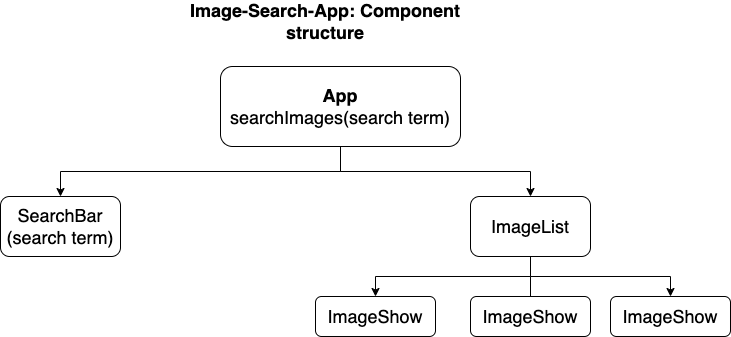
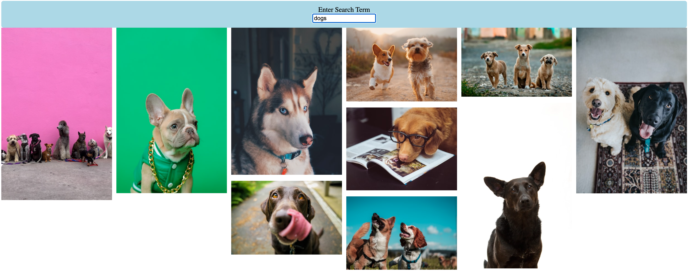

# Image Search App
this app uses the Unsplash API to display images based on a search term entered in the search box.

## Sample result
Below is the result for dogs

Typing cats in the search area will display 10 images of cats

## Technologies
- React

## packages
- dotenv
- axios

## Challenges
One of the challenge was to communicate props from children components to parent components.